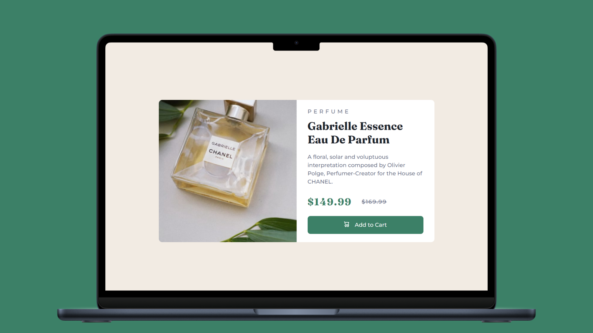

<h1 align="center">Product Preview Card Component 🛒</h1>

<p align="left">
  <a href="README.md" target="_blank">
    View README in English
  </a>
</p>

<p>Este repositorio contiene la resolución del reto "Product Preview Card Component" de Frontend Mentor. Es un proyecto ideal para principiantes que están buscando practicar sus habilidades en el diseño de componentes responsivos utilizando HTML y CSS.</p>
<hr>

<h1 align="center">Tecnologías Utilizadas</h1>
<div align="center">
  
  
</div>
<hr>

<h1 align="center">Objetivo</h1>
<ul>
  <li>Aprender y practicar CSS Grid para crear cartas de vista previa de productos.</li>
  <li>Diseñar un componente que se adapte a diferentes dispositivos.</li>
  <li>Mejorar tus habilidades en HTML y CSS.</li>
</ul>
<hr>

<h1 align="center">Características Principales</h1>
<ul>
  <li>Componente responsivo que se ajusta tanto a pantallas pequeñas como a escritorio.</li>
  <li>Organización de la estructura de la tarjeta con CSS Grid.</li>
  <li>Diseño clean y moderno siguiendo las guías de Frontend Mentor.</li>
</ul>
<hr>

<h1 align="center">Aprendizajes Adquiridos</h1>
<ul>
  <li>Creación de layouts responsivos con <b>CSS Grid</b>.</li>
  <li>Manejo de imágenes y contenido para una adecuada presentación.</li>
  <li>Uso de unidades relativas (%, em, rem) para un diseño más flexible.</li>
  <li>Organización y estructura del HTML y CSS de forma más limpia.</li>
</ul>
<hr>

<h1 align="center">Cómo Utilizar</h1>

1. Clona el repositorio en tu computadora:

    ```sh
     git clone https://github.com/JordanMedinaOrtiz/product-preview-card-component.git
     cd product-preview-card-component

2. Abre el archivo index.html en tu navegador.
<p>Este proyecto me ayudó a consolidar mis habilidades en CSS Grid y el diseño de componentes responsivos. Aunque es un proyecto sencillo, cada paso fue importante para avanzar en el dominio del frontend.</p>
<p>Puedes ver la demostración en línea <a href="https://jordanmedinaortiz.github.io/product-preview-card-component/" target="_blank">aquí</a>.</p>


